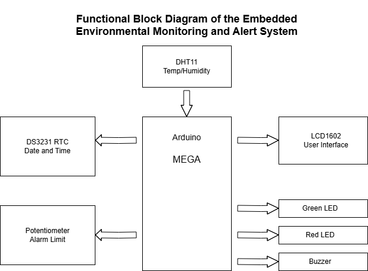
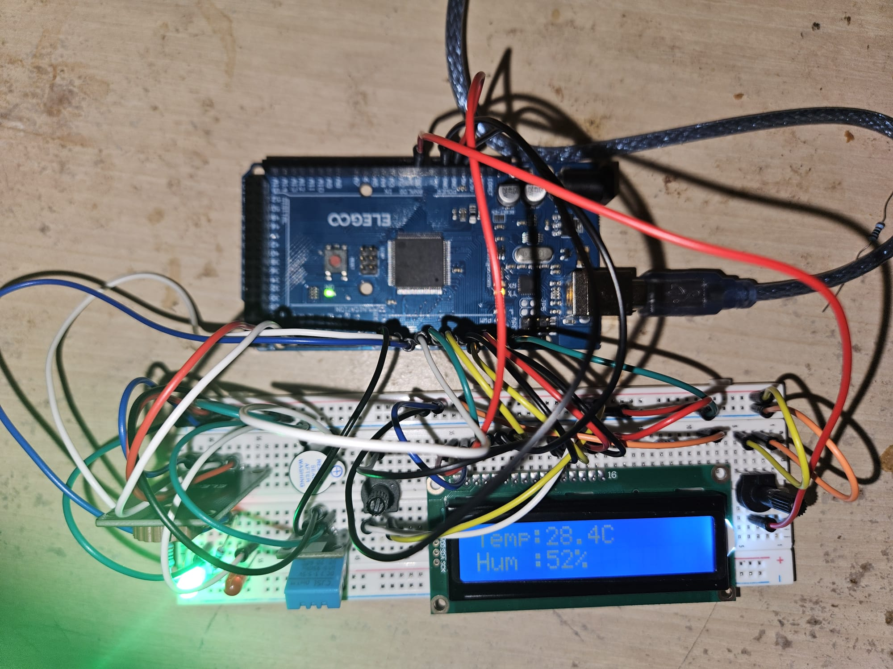
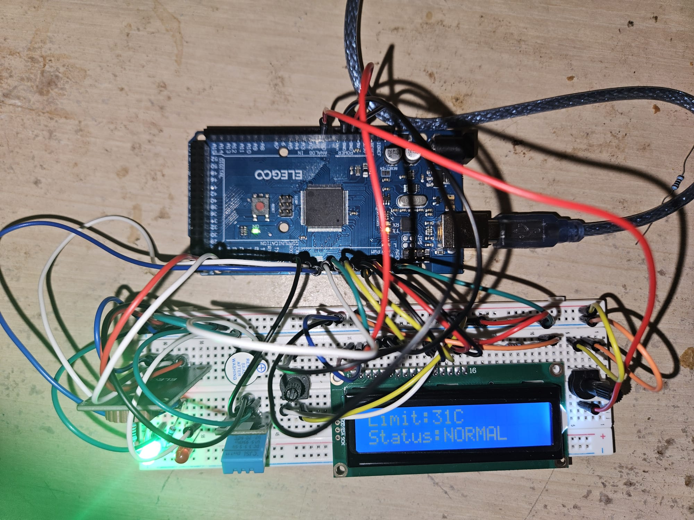
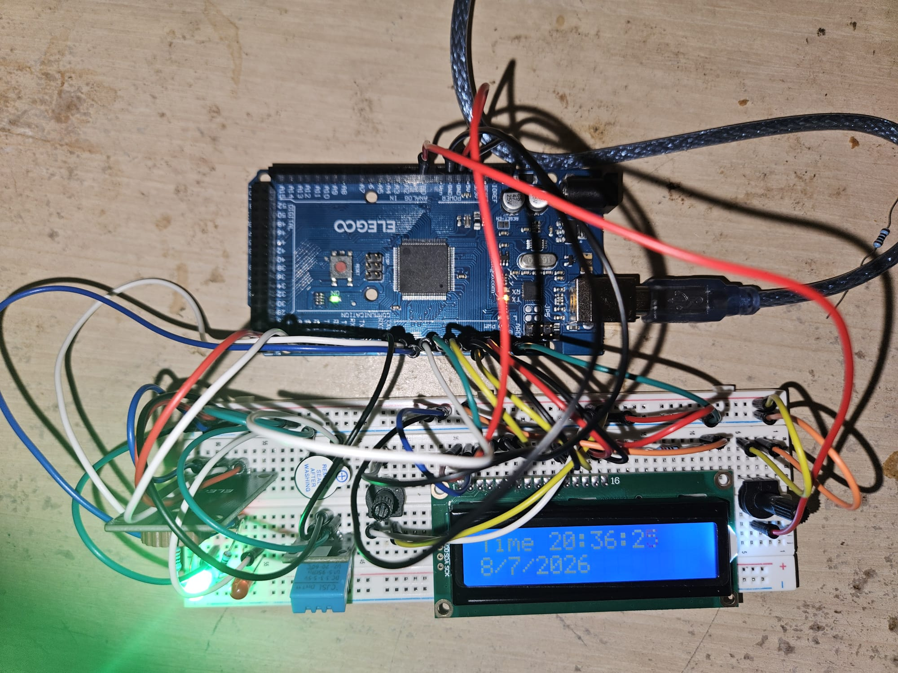
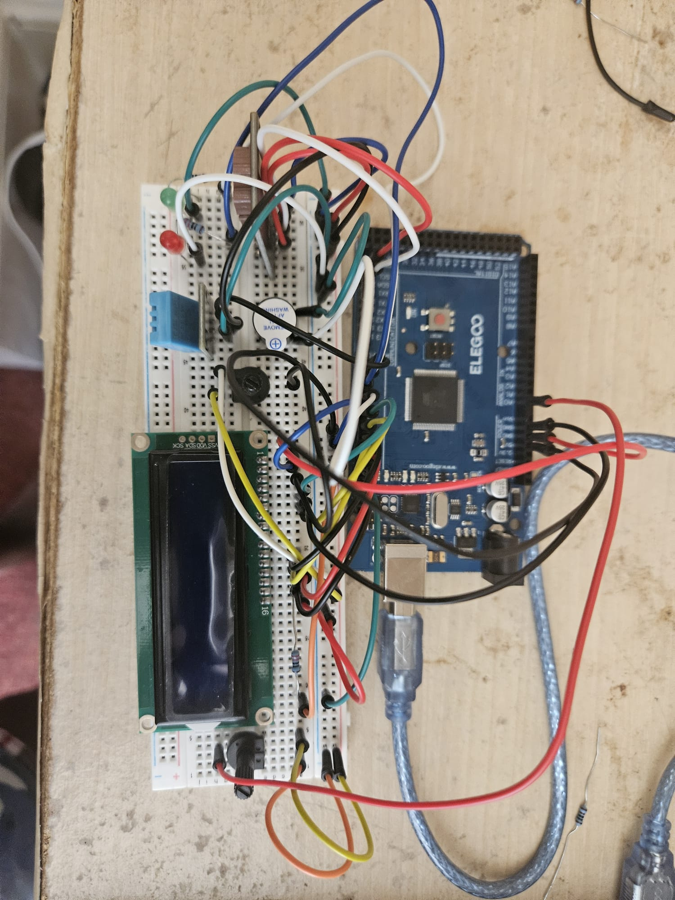

# Embedded Environmental Monitoring and Alert System

An Arduino Mega-based embedded environmental monitoring system that measures temperature and humidity in real time, displays system information through a multi-page LCD interface, provides configurable alarm thresholds, performs startup diagnostics, and generates visual and audible alerts when environmental limits are exceeded.

---

## Demo

<p align="center">
  
</p>

---

## Project Overview

This project demonstrates the design and implementation of a complete embedded monitoring system by integrating multiple sensors and peripherals into a single application.

The system continuously measures ambient temperature and humidity using a DHT11 sensor, retrieves accurate date and time information from a DS3231 Real-Time Clock (RTC), and presents information through a rotating LCD menu interface.

An adjustable alarm threshold allows the user to configure the trigger temperature using a potentiometer without modifying the program. When the measured temperature exceeds the selected threshold, the system activates both visual (LED) and audible (buzzer) alarms.

The project was developed to strengthen practical embedded systems skills including sensor interfacing, peripheral integration, embedded software design, debugging, and hardware documentation.

---

## Features

- Real-time temperature monitoring
- Real-time humidity monitoring
- Real-Time Clock (RTC) integration
- Multi-page LCD user interface
- Adjustable temperature alarm threshold
- Startup hardware diagnostics
- Visual alarm indication (LEDs)
- Audible alarm (buzzer)
- Serial monitoring for debugging
- Modular embedded C++ implementation

---

## Hardware Used

- Arduino Mega 2560
- DHT11 Temperature & Humidity Sensor
- DS3231 RTC Module
- LCD1602 Character Display
- Potentiometer
- Green LED
- Red LED
- Passive Buzzer
- Breadboard
- Jumper wires
- Resistors

---

## Software

- Arduino IDE
- Embedded C++
- LiquidCrystal Library
- RTClib
- Adafruit DHT Library

---

# Functional Block Diagram

<p align="center">

</p>

---

# Wiring Diagram

<p align="center">

</p>

---

# System Operation

### Startup Diagnostics

When powered on, the system performs hardware checks before entering normal operation.

- RTC verification
- DHT11 sensor verification
- System Ready confirmation

---

### Monitoring Mode

The LCD automatically rotates between three pages.

### Page 1

Displays:

- Temperature
- Humidity

<p align="center">

</p>

---

### Page 2

Displays:

- Adjustable alarm limit
- Current system status

<p align="center">

</p>

---

### Page 3

Displays:

- Current time
- Current date

<p align="center">

</p>

---

### Alarm Behaviour

When:

```
Temperature > User-defined Threshold
```

the system will:

- Turn ON the Red LED
- Turn OFF the Green LED
- Activate the buzzer
- Display ALARM status

Otherwise:

- Green LED remains ON
- Red LED remains OFF
- Buzzer remains OFF
- LCD displays NORMAL

---

## Project Structure

```
.
├── code/
│   └── EnvironmentalMonitoringSystem.ino
│
├── docs/
│   ├── block_diagram.png
│   └── wiring diagram.png
│
├── images/
│   ├── completed_system1.jpeg
│   ├── lcdpage1.jpeg
│   ├── lcdpage2.jpeg
│   └── lcdpage3.jpeg
│
├── Adobe Express - demo.gif
│
└── README.md
```

---

# Final Prototype

<p align="center">

</p>

---

## Skills Demonstrated

This project demonstrates practical experience with:

- Embedded C++ Programming
- Sensor Integration
- Embedded Software Design
- Analog-to-Digital Conversion (ADC)
- GPIO Programming
- I²C Communication
- Hardware Debugging
- User Interface Design
- Breadboard Prototyping
- Embedded System Documentation

---

## Future Improvements

Possible future enhancements include:

- OLED graphical display
- SD card data logging
- Wi-Fi connectivity (ESP32)
- Mobile dashboard
- MQTT cloud monitoring
- Current sensing
- Battery backup
- PCB implementation
- Enclosure design

---

## Author

**Hakeem Issah**

MSc Electronic & Electrical Engineering

Interests:
- Embedded Systems
- FPGA Design
- PCB Design
- Digital Hardware
- Hardware Verification
